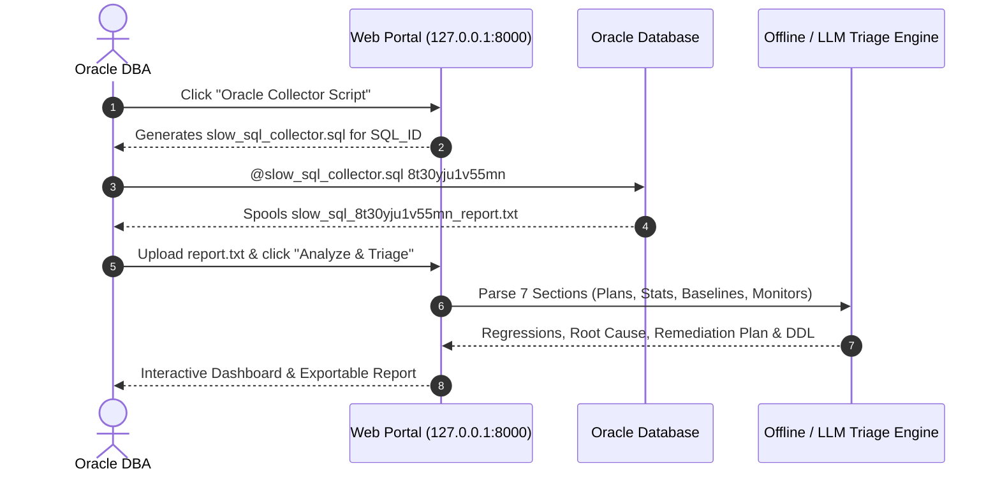

# slow-sql-triage-agent
The **Oracle DBA "Slow SQL" Triage Agent** is a dedicated diagnostic tool created using Python, designed to analyze degraded Oracle queries, detect Plan Hash Value (PHV) regressions,  identify stale object statistics, detect un-reproduced SQL Plan Baselines, and provide index recommendations with executable DDL.

# Oracle DBA "Slow SQL" Triage Agent
## Work PC Installation & User Guide (Zero-Admin Edition)
> **Audience**: Oracle DBAs and Performance Engineers on corporate Windows 10/11 workstations.  
> **Security Profile**: **Zero Administrator Privileges Required** • **No `.exe` Installers** • **Air-Gapped / Firewall-Safe (127.0.0.1 Loopback)**
---
## 1. Overview & Architecture

It runs locally on your laptop or desktop:
- **Offline Mode (Default)**: Completely air-gapped, zero external network calls, runs deterministic DBA diagnostic algorithms on your local machine.
- **LLM Mode (Optional)**: Connects to your choice of AI provider (Google Gemini, Anthropic Claude, OpenAI, or xAI Grok) if an API key and internet access are provided.
- **Future release** will work with locally avaialbe LLM's.
```
+-------------------------------------------------------------------------+
| Corporate Workstation (No Admin Rights Needed)                          |
|                                                                         |
|[WinPython Portable] <---> [ORCALE DBA Triage Engine] <--->[Web Browser] |
|   (Extracted .zip)          (FastAPI on 127.0.0.1)      (Edge/Chrome)   |
|                                     ^                                   |
|                                     | Spool file upload                 |
|                             +---------------+                           |
|                             | SQL*Plus / DB |                           |
|                             | Spool Output  |                           |
|                             +---------------+                           |
+-------------------------------------------------------------------------+
```

---

## 2. Required Packages & Prerequisites

You only need two ZIP archives. **No installation wizard or administrator credentials are required.**

| File | Purpose | Source / Location |
| :--- | :--- | :--- |
| **`dba_slow_sql_triage_airgapped_bundle.tar`** *(Recommended for No-Internet Jump Boxes)* | Complete app code, collector script, launcher, **plus all pre-packaged offline wheels** (~5.6 MB). Zero internet needed! | `dist/` folder / Shared drive / USB |
| **`dba_slow_sql_triage_latest.tar`** *(Lightweight)* | Standard app code (~58 KB) for machines with internet or proxy. | `dist/` folder |
| **`WinPython64-3.13.15.1dotb1.zip`** | Portable standalone Python runtime (pure ZIP, not an installer). | [WinPython Releases](https://github.com/winpython/winpython/releases) |


---

## 3. Step-by-Step Installation

### Step 3.1: Create Directory Structure
1. Open Windows File Explorer.
2. Navigate to a local folder where your user profile has full write permissions (e.g., `C:\Users\<YourUsername>\Documents`).
3. *(Example using `E:\ranam`)*:
   - Create `E:\ranam` if it doesn't already exist.'
     (when you do not have local admin rights)

### Step 3.2: Extract Portable WinPython
1. Place `WinPython64-3.13.15.1dotb1.zip` into `E:\ranam\`.
2. Right-click the zip file and choose **Extract All...** to `E:\ranam\WinPython64-3.13.15.1dotb1`.
3. Verify that the Python executable exists at:
   ```
   E:\ranam\WinPython64-3.13.15.1dotb1\python\python.exe
   ```

### Step 3.3: Extract the Triage Application
1. Place `oracle_dba_slow_sql_triage_latest.tar` into `E:\ranam\`.
2. Right-click and choose **Extract All...** to `E:\ranam\oracle_dba_slow_sql_triage`.
3. You should now see the following directory structure:
   ```
   E:\ranam\
   |-- WinPython64-3.13.15.1dotb1\
   |   `-- python\
   |       `-- python.exe
   |
   `-- oracle_dba_slow_sql_triage\
       |-- slow_sql\
       |-- config.json              <-- Host, Port & Jump Box Config
       |-- run_server.py            <-- Server runner reading config.json
       |-- run_work_pc.bat          <-- 1-Click launcher
       |-- slow_sql_collector.sql   <-- Oracle collection script
       |-- requirements.txt
       `-- README.md
   ```

---

## 4. Configuration & Jump Box Deployment

The application includes a centralized configuration file at `config.json`:

```json
{
  "server": {
    "bind_host": "0.0.0.0",
    "port": 8000,
    "public_host": "rana.ca",
    "auto_open_browser": true
  },
  "triage_defaults": {
    "default_engine": "local",
    "default_provider": "gemini",
    "default_gemini_model": "gemini-1.5-flash",
    "degradation_threshold": 2.0,
    "default_schema_owner": "SH"
  }
}
```

### Jump Box Sharing (`rana.ca`):
- When deployed on the jump box `rana.ca`, `bind_host` is set to `0.0.0.0` so colleagues across the network can connect.
- Colleague Access URL: **`http://rana.ca:8000`**
- Any colleague can open this URL in their browser without running any Python locally.

---

## 5. Starting the Application

### Option A: 1-Click Batch Launcher (Recommended)
1. Open the folder `E:\ranam\oracle_dba_slow_sql_triage\`.
2. **Double-click `run_work_pc.bat`**.
3. The script will automatically:
   - Detect WinPython in `E:\ranam\WinPython64-3.13.15.1dotb1\python\python.exe`.
   - Install required lightweight dependencies (`fastapi`, `uvicorn`, `pydantic`) inside your portable Python directory.
   - Read `config.json` and start the server.
   - Launch your default web browser (Edge/Chrome) directly to `http://127.0.0.1:8000` (or `http://rana.ca:8000`).

---

### Option B: PowerShell Command Line Launcher
If you prefer running from PowerShell:

1. Open PowerShell and navigate to the triage directory:
   ```powershell
   cd E:\ranam\oracle_dba_slow_sql_triage
   ```
2. Define the path to your portable Python executable:
   ```powershell
   $PYTHON = "E:\ranam\WinPython64-3.13.15.1dotb1\python\python.exe"
   ```
3. Run pip and start the server using the **`&` (call operator)**:
   ```powershell
   # Install dependencies
   & $PYTHON -m pip install -r requirements.txt

   # Start server reading config.json
   & $PYTHON run_server.py
   ```
4. Open your browser to `http://127.0.0.1:8000` (or your Jump Box URL).


> [!IMPORTANT]
> In PowerShell, you **must include the `&` operator** before `$PYTHON`. Typing `$PYTHON -m ...` without `&` causes an `Unexpected token '-m'` syntax error.

---

## 5. End-to-End Triage Workflow



### Step 5.1: Collect Data from Oracle
1. On the web portal, click **"Oracle Collector Script"** in the top navigation bar.
2. Enter your problem `SQL_ID` and click **"Generate Custom Script"** (or use the pre-packaged `slow_sql_collector.sql`).
3. Connect to your Oracle database via SQL*Plus, SQL Developer, or SQLcl:
   ```sql
   @slow_sql_collector.sql 8t30yju1v55mn
   ```
4. This script gathers all necessary diagnostic data into a single spool file:
   - SQL Text & Execution Summary across all historical Plan Hash Values (PHVs).
   - SQL Plan Baselines & SQL Profiles (`REPRODUCED`, `ACCEPTED`, `ENABLED`).
   - Tables involved, freshness of statistics (`STALE_STATS = YES/NO`), row counts, and last analyzed dates.
   - Comprehensive Index Metadata (Column names, order, uniqueness, clustering factor).
   - AWR / Shared Pool Execution Plans with Predicate Information.
   - Real-Time SQL Monitor Active Reports (if licensed).

### Step 5.2: Upload & Triage
1. Return to the web portal at `http://127.0.0.1:8000`.
2. Drag and drop (or click to upload) the spooled file (e.g., `slow_sql_8t30yju1v55mn_report.txt`).
3. Select your mode:
   - **Local Offline Engine (Air-Gapped)**: Instant, zero internet connection required, 100% confidential.
   - **LLM Connected Engine**: Select your provider (Google Gemini, OpenAI, Claude, Grok), enter your API key, and choose your model.
4. Click **"Analyze & Triage"**.

---

## 6. Interpreting the Triage Findings

The dashboard highlights critical performance issues in clear visual cards:

| Diagnostic Card | What It Checks | What It Means |
| :--- | :--- | :--- |
| **PHV Regression** | Historical elapsed time per execution across all plan hash values. | Alerts if a new plan is 2x+ slower than historical baseline plans. |
| **Stale Statistics** | `DBA_TAB_STATISTICS` staleness flags and date thresholds. | Stale stats often mislead the Cost-Based Optimizer (CBO) into poor join orders. |
| **SPM Baselines** | Checks if baselines exist and whether `REPRODUCED = NO`. | An un-reproduced baseline indicates Oracle could not match the outline hint hints. |
| **Cartesian / Scan Alerts** | Parses execution plan operations for `MERGE JOIN CARTESIAN` or `TABLE ACCESS FULL`. | High disk I/O and CPU burn due to unindexed join predicates. |
| **Remediation & DDL** | Automated index synthesis based on predicate columns. | Produces ready-to-run `CREATE INDEX ... ONLINE COMPUTE STATISTICS;` DDL. |

---

## 7. Troubleshooting & FAQ

### Q1: `pip install` fails with connection timeout / network error
**Cause**: Your corporate network requires an outbound HTTP/HTTPS proxy.  
**Fix**: Provide your corporate proxy flag to pip:
```powershell
& $PYTHON -m pip install --proxy http://your_proxy_server:port -r requirements.txt
```

### Q2: Typing `python` launches the Microsoft Windows Store
**Cause**: Windows 11 includes dummy "App Execution Aliases" that redirect to the Store if Python is not in the system registry.  
**Fix**: 
1. Open Windows **Settings** > **Apps** > **Advanced app settings** > **App execution aliases**.
2. Toggle **"App Installer (python.exe)"** and **"App Installer (python3.exe)"** to **OFF**.  
*(This requires zero administrator rights!)*

### Q3: Port 8000 is already in use by another application
**Cause**: Another service is listening on port 8000.  
**Fix**: Change the port to `8080` or `8888` when launching:
```powershell
& $PYTHON -m uvicorn slow_sql.web.app:app --host 127.0.0.1 --port 8080
```
Then visit `http://127.0.0.1:8080`.

### Q4: Will running this server trigger security alerts or firewall prompts?
**No.** The application binds exclusively to `127.0.0.1` (the local loopback interface). Windows Firewall only intercepts traffic on external or broadcast adapters (`0.0.0.0`). Loopback traffic remains strictly internal to your local PC.

---

## 8. Stopping the Application
To stop the server:
- If running from `run_work_pc.bat`: Press `Ctrl + C` in the command prompt window and type `Y`, or simply close the window.
- If running from PowerShell: Press `Ctrl + C`.
